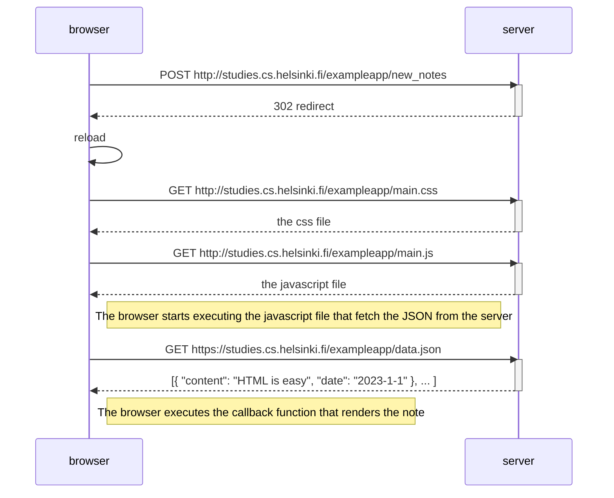

New note diagram

```mermaid
sequenceDiagram
    participant browser
    participant server

    browser->>server: POST http://studies.cs.helsinki.fi/exampleapp/new_notes
    activate server
    server-->>browser: 302 redirect
    deactivate server
    browser->>browser:  reload

    browser->>server: GET http://studies.cs.helsinki.fi/exampleapp/main.css
    activate server
    server-->>browser: the css file
    deactivate server

     browser->>server: GET http://studies.cs.helsinki.fi/exampleapp/main.js
    activate server
    server-->>browser: the javascript file
    deactivate server

    Note right of browser : The browser starts executing the javascript file that fetch the JSON from the server

    browser->>server: GET https://studies.cs.helsinki.fi/exampleapp/data.json
    activate server
    server-->>browser:  [{ "content": "HTML is easy", "date": "2023-1-1" }, ... ]
    deactivate server

    Note right of browser: The browser executes the callback function that renders the note


```